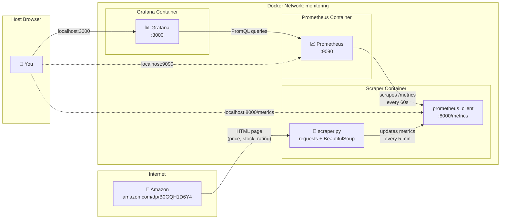

# claudeFun — Amazon Price Tracker

Monitors Amazon product prices and exposes them as Prometheus metrics, with a pre-built Grafana dashboard for visualization.

**Currently tracking:** [SMALLRIG Compartment Aluminum Case (B0GQH1D6Y4)](https://www.amazon.com/dp/B0GQH1D6Y4)

---

## Architecture



## Stack

| Service | Purpose |
|---|---|
| Python scraper | Fetches Amazon product page every 5 minutes |
| [prometheus_client](https://github.com/prometheus/client_python) | Exposes metrics at `:8000/metrics` |
| [Prometheus](https://prometheus.io) | Scrapes and stores time-series data |
| [Grafana](https://grafana.com) | Visualizes price history and scraper health |

---

## Quick Start

```bash
cd amazon_price_tracker
docker compose up -d
```

| URL | What |
|---|---|
| http://localhost:3000 | Grafana (admin / admin) |
| http://localhost:9090 | Prometheus UI |
| http://localhost:8000/metrics | Raw Prometheus metrics |

The Grafana dashboard loads automatically on first boot.

---

## Metrics

```
amazon_product_price_usd            Current price in USD
amazon_product_original_price_usd   Original list price
amazon_product_discount_percent     Discount off list price
amazon_product_in_stock             1 = in stock, 0 = out of stock
amazon_product_rating               Star rating (0–5)
amazon_product_review_count         Number of customer reviews
amazon_scrape_duration_seconds      Histogram of page fetch time
amazon_scrape_errors_total          Errors by type (timeout, captcha, http_*)
amazon_scrapes_total                Total scrape attempts
amazon_last_scrape_timestamp_seconds Unix timestamp of last successful scrape
```

All metrics are labeled with `asin` and `product`.

---

## Grafana Dashboard

![Dashboard panels: current price, list price, discount %, availability, price history chart, scraper health]

- **Price Over Time** — current vs list price overlaid
- **Discount % History** — bar chart of savings over time
- **Star Rating** — gauge (0–5)
- **Review Count** — trending stat
- **Scrape Duration p50/p95/p99** — latency percentiles
- **Errors by Type** — `timeout`, `captcha`, `http_4xx`, etc.
- **Last Successful Scrape** — staleness indicator

---

## Configuration

Set via environment variables in `docker-compose.yml`:

| Variable | Default | Description |
|---|---|---|
| `ASIN` | `B0GQH1D6Y4` | Amazon product ASIN |
| `PRODUCT_NAME` | `SMALLRIG Compartment Aluminum Case` | Human-readable label |
| `SCRAPE_INTERVAL` | `300` | Seconds between scrapes |
| `METRICS_PORT` | `8000` | Port for `/metrics` endpoint |

### Track a different product

1. Find the ASIN in the Amazon URL (`/dp/XXXXXXXXXX`)
2. Update `docker-compose.yml`:
```yaml
environment:
  ASIN: "YOUR_ASIN_HERE"
  PRODUCT_NAME: "Your Product Name"
```
3. `docker compose up -d --build`

---

## Project Structure

```
amazon_price_tracker/
├── scraper.py                            # Scraper + Prometheus instrumentation
├── Dockerfile
├── docker-compose.yml
├── prometheus.yml                        # Prometheus scrape config
└── grafana/
    ├── dashboards/
    │   └── amazon_price.json             # Auto-provisioned Grafana dashboard
    └── provisioning/
        ├── datasources/prometheus.yaml
        └── dashboards/dashboard.yaml
```

---

## Notes

> **Amazon bot protection:** Amazon aggressively rate-limits scrapers. If you see `captcha` errors in the scraper logs, the scraper backs off exponentially (up to 1 hour). Adding a residential proxy via `HTTP_PROXY` / `HTTPS_PROXY` env vars can help.

> This project is for personal/educational use. Always respect Amazon's [Conditions of Use](https://www.amazon.com/gp/help/customer/display.html?nodeId=508088).
