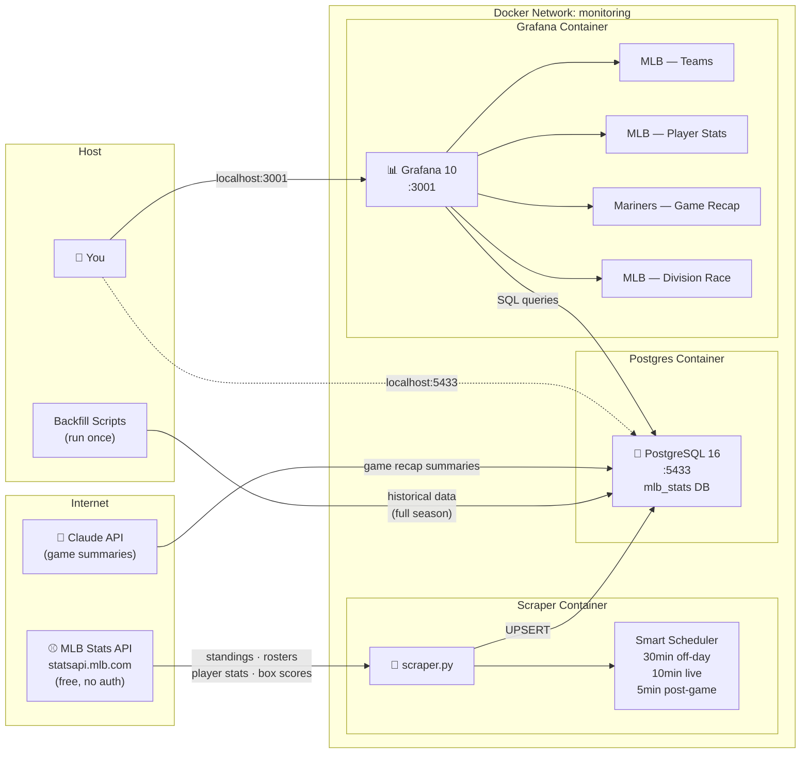
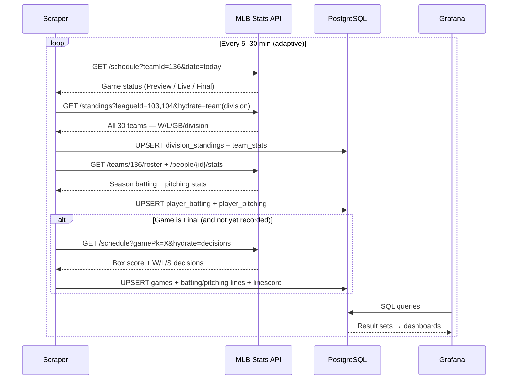

# MLB Stats Tracker

Tracks MLB player and team statistics using the official MLB Stats API, stores them in PostgreSQL, and visualizes them across four Grafana dashboards — automatically updated after every game.

---

## Architecture



---

## Data Flow



---

## Stack

| Service | Purpose |
|---|---|
| Python scraper | Polls MLB Stats API, upserts to Postgres each cycle |
| [MLB Stats API](https://statsapi.mlb.com) | Official free API — no key required |
| [PostgreSQL 16](https://www.postgresql.org) | Stores all historical stats |
| [Grafana 10](https://grafana.com) | Four dashboards using PostgreSQL datasource |
| [Claude API](https://anthropic.com) | Generates AI game recap summaries (optional) |

---

## Quick Start

```bash
cd mlb_stats_tracker
docker compose up -d
```

| URL | What |
|---|---|
| http://localhost:3001 | Grafana (admin / admin) |
| http://localhost:5433 | PostgreSQL (mlb / mlbpass) |

All four Grafana dashboards load automatically on first boot.

### Backfill historical data (run once after first boot)

```bash
# Full season standings for all 30 teams
docker exec -it mlb_stats_scraper python backfill_standings.py

# Full season batting + pitching stats for SEA roster
docker exec -it mlb_stats_scraper python backfill_player_stats.py

# Box scores for all 162 Mariners regular season games
docker exec -it mlb_stats_scraper python backfill_game_recaps.py

# Optionally add spring training game recaps
docker exec -it mlb_stats_scraper python backfill_spring_training.py
```

### Generate AI game summaries (requires Anthropic API key)

```bash
ANTHROPIC_API_KEY=sk-... docker exec -it mlb_stats_scraper python backfill_game_recaps.py
```

---

## Database Schema

```
team_stats          date · season · team · wins · losses · win_pct · GB · streak · …
division_standings  date · season · team · division · wins · losses · GB
player_batting      date · season · player_id · AVG · OBP · SLG · OPS · HR · RBI · …
player_pitching     date · season · player_id · ERA · WHIP · FIP · K/9 · W · L · SV · …
games               gamepk · date · home/away · score · result · W/L/S pitchers
game_batting_lines  gamepk · player_id · AB · H · HR · RBI · BB · SO · …
game_pitching_lines gamepk · player_id · IP · H · R · ER · BB · SO · ERA · note (W/L/S)
game_linescore      gamepk · inning · team · runs · hits · errors
game_summaries      gamepk · ai_summary (Claude-generated recap text)
```

All tables use `ON CONFLICT … DO UPDATE` — safe to re-run backfills or scrape repeatedly.

---

## Grafana Dashboards

### MLB — Teams (`/d/mlb-sea-team`)

Team dropdown covers all 30 MLB teams.

```
Season Record      Wins · Losses · Win% · GB · Streak · Last 10
Season Trends      Wins & losses over time · Run differential
Batting Leaders    AVG / OBP / SLG / OPS / HR / RBI (color-coded)
Pitching Leaders   ERA / WHIP / FIP / W / L / SV / K9
Division Context   Selected team's games-behind progression
```

### MLB — Player Stats (`/d/mlb-sea-player`)

Per-player drill-down with `$batter` and `$pitcher` dropdowns.

```
Batter   AVG · OBP · SLG · OPS · ISO · BABIP over season
         HR & RBI & Runs accumulation · projected HR pace
Pitcher  ERA · WHIP · FIP over season · K/9 vs BB/9 trends
```

### Mariners — Game Recap (`/d/mlb-sea-recap`)

Select any game from the season by date (e.g. `Mar 28  vs ATH  (W 4-2)`).

```
Game Header    Result · Date/Venue · Winning · Losing · Save pitcher
Line Score     Inning-by-inning runs/hits/errors
Box Score      Full batting lines (AB/H/HR/RBI/BB/SO/SB)
               Full pitching lines (IP/H/R/ER/BB/K/ERA)
AI Summary     Claude-generated 3-paragraph game recap
```

### MLB — Division Race (`/d/mlb-division-race`)

All six divisions side-by-side.

```
Each division:
  Standings table   W / L / PCT / GB (current snapshot)
  Race chart        Games-behind progression for all 5 teams over the season
```

---

## Smart Polling

The scraper adapts its sleep interval based on today's game status:

| Game State | Next Poll |
|---|---|
| No game today | 30 min |
| `Preview` (upcoming) | 30 min |
| `Live` (in progress) | 10 min |
| `Final` (just ended) | 5 min |

---

## Configuration

Set via environment variables in `docker-compose.yml`:

| Variable | Default | Description |
|---|---|---|
| `TEAM_ID` | `136` | MLB team ID (136 = Mariners) |
| `TEAM_ABBR` | `SEA` | Team abbreviation used in game recap queries |
| `SEASON` | `2025` | Season to track |
| `DB_HOST` | `postgres` | PostgreSQL host |
| `DB_NAME` | `mlb_stats` | Database name |
| `DB_USER` | `mlb` | Database user |
| `DB_PASS` | `mlbpass` | Database password |
| `ANTHROPIC_API_KEY` | _(unset)_ | Required only for AI game summaries |

### Track a different team

1. Find the team ID at `https://statsapi.mlb.com/api/v1/teams?sportId=1`
2. Update `docker-compose.yml`:
   ```yaml
   environment:
     TEAM_ID: "117"
     TEAM_ABBR: "HOU"
   ```
3. Update `team='SEA'` filters in `game_recap.json` dashboard panels
4. `docker compose up -d --build`

---

## Tests

```bash
cd mlb_stats_tracker
pip install pytest
pytest tests/ -v
```

133 unit tests covering:

| File | What's tested |
|---|---|
| `test_conversions.py` | `sf()` / `si()` safe casts, `ip_to_thirds()` / `thirds_to_ip()` |
| `test_parse_boxscore.py` | `parse_batting_lines`, `parse_pitching_lines`, `parse_linescore` |
| `test_format_text.py` | `format_linescore_text`, `format_batting_text`, `format_pitching_text` |
| `test_game_label.py` | Grafana dropdown label expression — NULL-safety, formatting, full-season coverage |

All tests are pure unit tests (no DB, no network). GitHub Actions runs them on every push to `mlb_stats_tracker/`.

---

## Project Structure

```
mlb_stats_tracker/
├── scraper.py                    # MLB API poller + PostgreSQL upserts
├── backfill_standings.py         # Historical standings for all 30 teams
├── backfill_player_stats.py      # Historical batting/pitching stats
├── backfill_game_recaps.py       # Historical box scores + AI summaries
├── backfill_spring_training.py   # Spring training game recaps
├── schema.sql                    # Database schema (9 tables)
├── Dockerfile
├── docker-compose.yml
├── pytest.ini
├── tests/
│   ├── conftest.py               # Shared fixtures (realistic MLB API response data)
│   ├── test_conversions.py
│   ├── test_parse_boxscore.py
│   ├── test_format_text.py
│   └── test_game_label.py
└── grafana/
    ├── dashboards/
    │   ├── team_overview.json    # MLB — Teams (all 30 teams, dropdown)
    │   ├── player_stats.json     # Player drill-down with batter/pitcher dropdowns
    │   ├── game_recap.json       # Per-game box score + AI summary
    │   └── division_race.json    # All 6 divisions standings + race charts
    └── provisioning/
        ├── datasources/postgres.yaml
        └── dashboards/dashboard.yaml
```

---

## Notes

> **Ports:** Uses `3001` (Grafana) and `5433` (PostgreSQL) to avoid conflicts if the Amazon price tracker is also running simultaneously.

> **Data source:** The [MLB Stats API](https://statsapi.mlb.com/api/v1) is the official MLB data feed. It is free, requires no API key, and updates within ~30 minutes of game completion.

> **Idempotent writes:** All scraper and backfill writes use `INSERT … ON CONFLICT DO UPDATE`, so re-running any script is safe and will not duplicate data.
