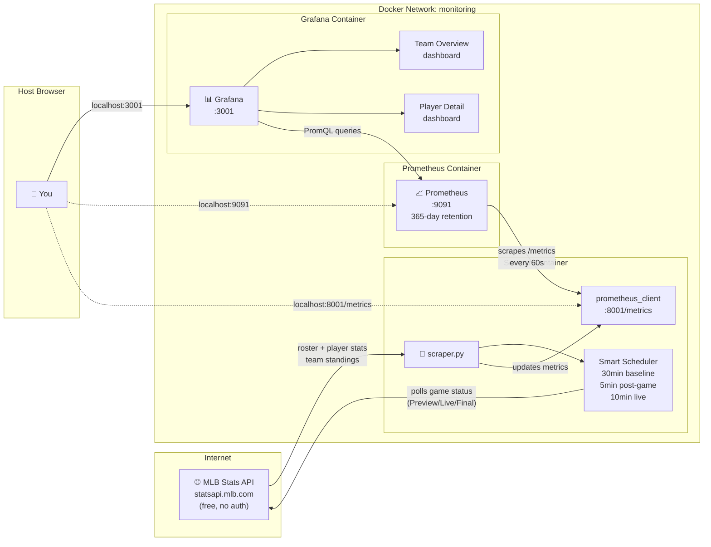
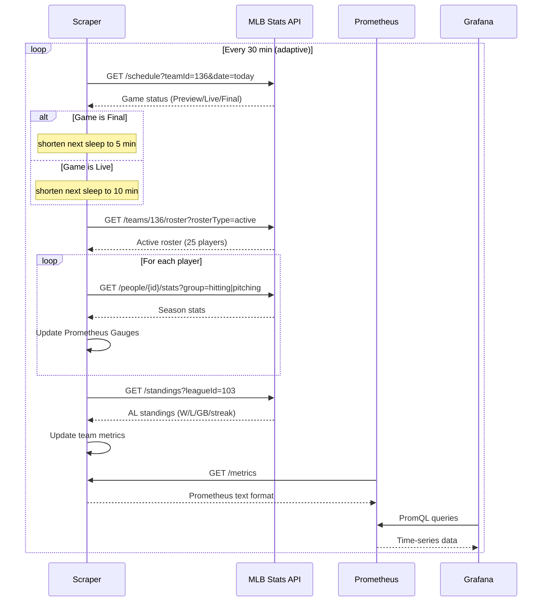
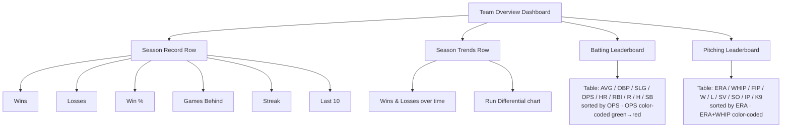
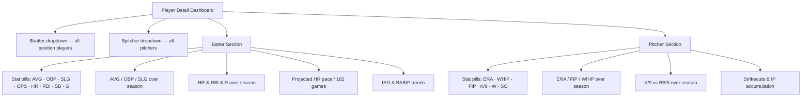

# Seattle Mariners Stats Tracker

Tracks Seattle Mariners player and team statistics using the official MLB Stats API, stores them as Prometheus metrics, and visualizes them in Grafana dashboards — automatically updated after every game.

---

## Architecture



---

## Data Flow



---

## Stack

| Service | Purpose |
|---|---|
| Python scraper | Pulls from MLB Stats API, updates metrics each cycle |
| [MLB Stats API](https://statsapi.mlb.com) | Official free API — no key required |
| [prometheus_client](https://github.com/prometheus/client_python) | Exposes metrics at `:8001/metrics` |
| [Prometheus](https://prometheus.io) | Scrapes and stores 365 days of history |
| [Grafana](https://grafana.com) | Two dashboards: team overview + player drill-down |

---

## Quick Start

```bash
cd mlb_stats_tracker
docker compose up -d
```

| URL | What |
|---|---|
| http://localhost:3001 | Grafana (admin / admin) |
| http://localhost:9091 | Prometheus UI |
| http://localhost:8001/metrics | Raw Prometheus metrics |

Both Grafana dashboards load automatically on first boot.

---

## Metrics

### Batting (per player)

```
mlb_player_batting_avg          Batting average (AVG)
mlb_player_obp                  On-base percentage
mlb_player_slg                  Slugging percentage
mlb_player_ops                  OPS (OBP + SLG)
mlb_player_iso                  Isolated power (SLG - AVG)
mlb_player_babip                BABIP
mlb_player_home_runs_total      Home runs
mlb_player_rbi_total            Runs batted in
mlb_player_hits_total           Hits
mlb_player_at_bats_total        At bats
mlb_player_runs_total           Runs scored
mlb_player_walks_total          Walks (BB)
mlb_player_strikeouts_total     Strikeouts
mlb_player_stolen_bases_total   Stolen bases
mlb_player_doubles_total        Doubles
mlb_player_triples_total        Triples
mlb_player_games_played_total   Games played
```

### Pitching (per player)

```
mlb_pitcher_era                 Earned run average
mlb_pitcher_whip                WHIP (walks + hits per inning)
mlb_pitcher_fip                 FIP (fielding independent pitching)*
mlb_pitcher_wins_total          Wins
mlb_pitcher_losses_total        Losses
mlb_pitcher_saves_total         Saves
mlb_pitcher_holds_total         Holds
mlb_pitcher_strikeouts_total    Strikeouts
mlb_pitcher_walks_total         Walks allowed
mlb_pitcher_innings_pitched     Innings pitched
mlb_pitcher_k9                  Strikeouts per 9 innings
mlb_pitcher_bb9                 Walks per 9 innings
mlb_pitcher_hr9                 Home runs per 9 innings
mlb_pitcher_games_total         Games pitched
mlb_pitcher_quality_starts_total Quality starts
```

> *FIP is calculated client-side: `((13×HR + 3×BB − 2×SO) / IP) + 3.10`

### Team

```
mlb_team_wins_total             Season wins
mlb_team_losses_total           Season losses
mlb_team_win_pct                Win percentage
mlb_team_games_behind           Games behind division leader (0 = first place)
mlb_team_runs_scored_total      Runs scored (season)
mlb_team_runs_allowed_total     Runs allowed (season)
mlb_team_streak                 Current streak (+N = win streak, −N = loss streak)
mlb_team_home_wins_total        Home wins
mlb_team_away_wins_total        Away wins
mlb_team_last10_wins            Wins in last 10 games
```

All player metrics are labeled with `team`, `player`, `player_id`, and `position`.
All team metrics are labeled with `team`, `team_id`, and `division`.

---

## Grafana Dashboards

### Team Overview (`localhost:3001`)



### Player Detail (`localhost:3001/d/mlb-sea-player`)



---

## Smart Polling

The scraper adapts its sleep interval based on today's game status:

| Game State | Next Poll |
|---|---|
| No game today | 30 min (default) |
| `Preview` (upcoming) | 30 min |
| `Live` (in progress) | 10 min |
| `Final` (just ended) | 5 min — catches box score finalization |

---

## Configuration

Set via environment variables in `docker-compose.yml`:

| Variable | Default | Description |
|---|---|---|
| `TEAM_ID` | `136` | MLB team ID (136 = Mariners) |
| `TEAM_ABBR` | `SEA` | Short label used in all metric labels |
| `SEASON` | current year | Season to pull stats for |
| `POLL_INTERVAL` | `1800` | Baseline seconds between scrapes |
| `METRICS_PORT` | `8001` | Port for `/metrics` endpoint |

### Track a different team

1. Find the team ID at `https://statsapi.mlb.com/api/v1/teams?sportId=1`
2. Update `docker-compose.yml`:
```yaml
environment:
  TEAM_ID: "117"        # Houston Astros, for example
  TEAM_ABBR: "HOU"
```
3. Update the hardcoded `team="SEA"` PromQL filters in the Grafana dashboard JSON
4. `docker compose up -d --build`

---

## Project Structure

```
mlb_stats_tracker/
├── scraper.py                              # MLB API poller + Prometheus instrumentation
├── Dockerfile
├── docker-compose.yml
├── prometheus.yml                          # Prometheus scrape config (365-day retention)
└── grafana/
    ├── dashboards/
    │   ├── team_overview.json              # Season record, standings, roster tables
    │   └── player_stats.json              # Per-player drill-down with dropdowns
    └── provisioning/
        ├── datasources/prometheus.yaml
        └── dashboards/dashboard.yaml
```

---

## Notes

> **Ports:** Uses `3001` (Grafana), `9091` (Prometheus), `8001` (metrics) to avoid conflicting with the Amazon price tracker if both are running simultaneously.

> **Data source:** The [MLB Stats API](https://statsapi.mlb.com/api/v1) is the official Statcast/MLB data feed. It is free, requires no API key, and updates within ~30 minutes of game completion.

> **Season history:** Prometheus retention is set to 365 days so you capture the full season and can compare trends across months.
