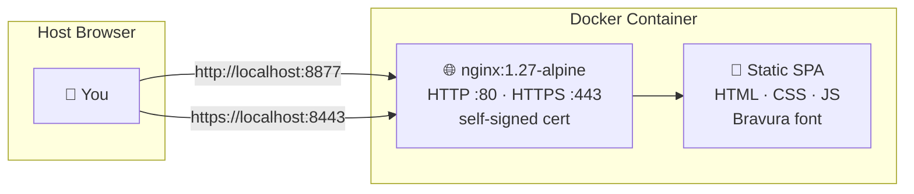

# Music Notation Trainer

Interactive web app for learning to read musical notation and identify piano keys. A note is displayed on a grand staff (treble + bass clef) and you click the corresponding key on the piano keyboard.

---

## Architecture



## Stack

| Component | Purpose |
|---|---|
| HTML / CSS / JS | Single-page app — no build step, no frameworks |
| [Bravura](https://github.com/steinbergmedia/bravura) (WOFF2) | SMuFL music font for engraving-quality clef rendering |
| Web Audio API | Audio feedback — sine tone for correct, sawtooth buzz for incorrect |
| nginx (Alpine) | Serves static files with gzip, caching, and self-signed TLS |

---

## Quick Start

```bash
cd music-notation-trainer
docker compose up -d --build
```

| URL | What |
|---|---|
| http://localhost:8877 | HTTP (no cert warning) |
| https://localhost:8443 | HTTPS (self-signed cert) |

---

## How It Works

1. A random note is displayed on the grand staff (C3 through C6)
2. Click the correct piano key at the bottom of the screen
3. **Correct** — green highlight, pleasant tone, score +1, streak +1
4. **Incorrect** — red highlight on your guess, green on the correct key, buzz tone, streak resets
5. Auto-advances to the next note after a short delay

### Hold to Show Notes

Press and hold the **"Hold to Show Notes"** button to pop up a large reference grand staff with every note labeled — useful while learning.

---

## Features

| Feature | Details |
|---|---|
| Grand staff | Treble + bass clef with proper ledger lines for middle C, A5, C6 |
| Piano keyboard | Fluid-width CSS keyboard spanning C3–C6 (22 white, 15 black keys) |
| Score tracking | Correct count + current streak |
| Reference staff | Hold-to-reveal overlay with all notes labeled on the staff |
| Settings | Note range (full / treble only / bass only), note name hint, sound on/off |
| Audio feedback | Web Audio API tones — no external audio files |
| Keyboard shortcut | Press `R` for a new note |
| Responsive | Works on desktop and mobile |
| Persistence | Settings saved to localStorage |

---

## Settings

Click the gear icon to configure:

| Setting | Options | Default |
|---|---|---|
| Note Range | Full Grand Staff (C3–C6) · Treble Only (C4–G5) · Bass Only (C3–B3) | Full |
| Show Note Name Hint | Displays the note name above the staff | Off |
| Sound Feedback | Enables/disables audio tones | On |

---

## Project Structure

```
music-notation-trainer/
├── index.html           # Page structure, settings modal, reference overlay
├── style.css            # Cornflower blue theme, responsive layout, key states
├── theory.js            # Note catalog C3–C6 with staff positions and MIDI numbers
├── staff.js             # SVG grand staff renderer (Bravura font clefs, ledger lines)
├── keyboard.js          # Fluid CSS piano keyboard builder
├── app.js               # Game loop: scoring, feedback, audio, settings
├── Bravura.woff2        # SMuFL music font (SIL Open Font License)
├── nginx.conf           # nginx config: HTTP + HTTPS, gzip, caching
├── Dockerfile           # nginx:1.27-alpine + openssl for self-signed cert
└── docker-compose.yml   # Single service, ports 8877 (HTTP) + 8443 (HTTPS)
```

---

## Notes

> **Bravura font:** The treble and bass clef symbols are rendered using [Bravura](https://github.com/steinbergmedia/bravura), the reference font for the [SMuFL](https://www.w3.org/2021/03/smufl14/) standard, released under the SIL Open Font License.

> **No external dependencies:** The entire app is vanilla HTML/CSS/JS with no build step, package manager, or framework. Just static files served by nginx.

> **Cache busting:** Asset references in `index.html` include `?v=N` query strings. Bump the version number after deploying changes to avoid stale browser caches.
